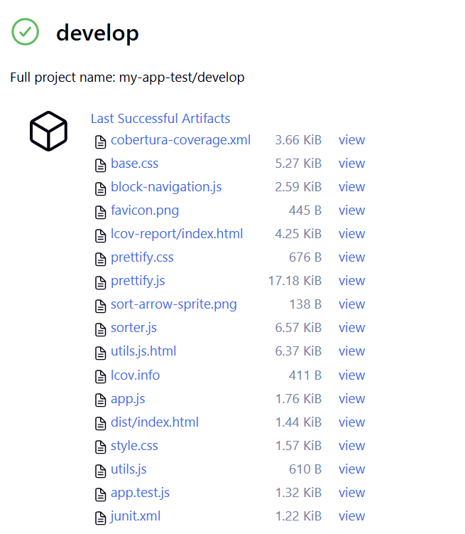

# TP Node.js/Jenkins : Intégration Continue et Déploiement

## Contexte
J’ai configuré un environnement sur **VS Code** pointant vers le répertoire de mon conteneur Docker, dans lequel j’ai installé et configuré **Jenkins**. J’ai également installé le plugin **NodeJS** pour Jenkins afin de gérer une pipeline de déploiement pour un projet Node.js.

---

## Exercice 1 : Premier déploiement
### Étapes réalisées :
1. **Installation de Node.js 18 et npm** dans le conteneur Ubuntu.
2. **Installation des dépendances** du projet avec `npm install`.
3. **Ajout du reporter JUnit pour Jest** dans le `package.json` :
   ```json
   "jest": {
     "reporters": [
       "default",
       ["jest-junit", { "outputDirectory": "tests", "outputName": "junit.xml" }]
     ]
   }
   ```
4. **Modification du `Jenkinsfile`** pour que Jenkins récupère le rapport de test généré par Jest (`test-results.xml`).
5. **Vérification** que le fichier `test-results.xml` est bien créé après l’exécution des tests.

---

## Exercice 2 : Gestion des branches
1. **Création d’une branche `develop`** dans le dépôt Git.
2. **Configuration d’un projet multi-branch** dans Jenkins pour :
   - Récupérer toutes les branches du dépôt.
   - Déclencher la pipeline sur les branches `main` ou `develop`.

---

## Exercice 3 : Tests et qualité
### Ajout d’un test volontairement échoué
J’ai ajouté un test incorrect pour simuler une erreur :
```javascript
test('Tests échoué', () => {
    expect(isValidNumber(Infinity)).toBe(true); // Ce test échoue car `isValidNumber(Infinity)` retourne `false`
});
```
- **Résultat initial** :
  ```
  expect(received).toBe(expected) // Object.is equality
  Expected: true
  Received: false
  ```
  Le job de test affichait une erreur dans la **Pipeline Overview**.

- **Après correction** :
  ```
  Test Suites: 1 passed, 1 total
  Tests:       6 passed, 6 total
  Snapshots:   0 total
  ```
  Le job de test est passé en **success**.

---

## Exercice 4 : Configuration avancée
### Notifications Discord
J’ai créé un **serveur Discord** et configuré un **webhook** pour recevoir des notifications automatiques depuis Jenkins.
Dans le `Jenkinsfile`, j’ai ajouté une section `post` pour gérer trois cas :
- **🟢 Success** : Notification Discord confirmant le succès du déploiement.
- **🔴 Failure** : Notification avec l’erreur en cas d’échec.
- **⚠️ Unstable** : Notification en cas de warnings ou de build instable.

**Processus** :
1. Génération d’un fichier `payload.json` au format attendu par l’API Discord.
2. Envoi du message via `curl` avec le webhook.
3. Suppression du fichier temporaire.

**Résultat** :


---

### Couverture de code
1. **Installation du plugin Code Coverage API** dans Jenkins.
2. **Modification du `package.json`** pour générer un rapport Cobertura :
   ```json
   "jest": {
     "collectCoverage": true,
     "coverageDirectory": "coverage",
     "coverageReporters": ["text", "cobertura"],
     "rootDir": ".",
     "reporters": [
       "default",
       ["jest-junit", { "outputDirectory": "/tmp/tests", "outputName": "junit.xml" }]
     ]
   }
   ```
3. **Configuration initiale de `publishCoverage`** avec des seuils :
   ```groovy
   publishCoverage adapters: [
       coberturaAdapter('coverage/cobertura-coverage.xml')
   ],
   failNoReports: true,
   globalThresholds: [
       [thresholdTarget: 'LINE', unhealthyThreshold: 70.0, unstableThreshold: 80.0],
       [thresholdTarget: 'BRANCH', unhealthyThreshold: 60.0, unstableThreshold: 70.0]
   ]
   ```

#### Problème rencontré
Le plugin **Code Coverage API** a généré une **`NullPointerException`** car certaines métriques (comme `CLASS` ou `METHOD`) étaient manquantes dans le rapport Cobertura. Le plugin tentait d’appliquer des seuils sur des valeurs inexistantes.

#### Solution appliquée
J’ai **supprimé la section `globalThresholds`** pour éviter les erreurs :
```groovy
publishCoverage adapters: [
    coberturaAdapter('coverage/cobertura-coverage.xml')
],
failNoReports: true
```
Désormais, Jenkins :
- Analyse le rapport de couverture.
- L’affiche dans l’interface **sans validation bloquante**.

**Vue du rapport dans Jenkins** :


---

### Archivage des artefacts
J’ai ajouté une étape pour archiver les artefacts :
```groovy
stage('Archive Artifacts') {
    steps {
        echo 'Archivage des artefacts...'
        archiveArtifacts artifacts: 'coverage/**/*, tests/**/*, dist/**/*', allowEmptyArchive: true
    }
}
```
**Résultat** :


---

## Questions de compréhension

### 1. Différence entre `npm install` et `npm ci`
- **`npm install`** :
  Installe les dépendances en mettant à jour le `package-lock.json` si nécessaire. Utile en développement, mais moins adapté à la CI/CD car il peut introduire des variations entre les builds.
- **`npm ci`** :
  Installe **exactement** les versions spécifiées dans le `package-lock.json`. Plus rapide et plus fiable pour des **builds reproductibles** en CI/CD.

### 2. Utilisation de `when` dans les étapes
J’utilise `when` pour exécuter des étapes **conditionnellement** :
- Exemple : Déployer uniquement sur les branches `main` ou `develop`.
- Avantages : Évite des actions inutiles ou dangereuses sur d’autres branches.

### 3. Gestion des erreurs avec les blocs `post`
Les blocs `post` me permettent de :
- **Envoyer des notifications** (Discord, email, etc.) selon le résultat du pipeline (`success`, `failure`, `unstable`).
- **Exécuter des actions correctives** (ex : nettoyage, rollback).

### 4. Intérêt du backup avant déploiement
Avant de déployer une nouvelle version, je sauvegarde l’ancienne. En cas d’échec ou de bug, je peux **restaurer rapidement** l’application à son état précédent.

---

## Améliorations possibles

### Sécurité
- Intégrer **`npm audit`** ou des outils comme **Snyk** pour scanner automatiquement les vulnérabilités des dépendances.

### Performance
- **Mettre en cache** `node_modules` ou les artefacts intermédiaires pour réduire les temps de build.

### Monitoring
- Ajouter un **health check automatisé** après le déploiement.
- Utiliser **Prometheus/Grafana** pour surveiller l’état de l’application en temps réel.

### Rollback
- Mettre en place un **mécanisme de rollback automatique** si le déploiement échoue ou si le health check détecte un problème.

---

## Bilan
Ce TP m’a permis de :
✅ Configurer une pipeline CI/CD complète avec Jenkins et Node.js.
✅ Gérer les tests, la couverture de code, et les notifications.
✅ Automatiser des actions post-build (archivage, notifications, backup).
✅ Identifier des axes d’amélioration pour la sécurité, la performance et la fiabilité.

---
**Prochaines étapes** :
- Automatiser davantage les tests de sécurité.
- Optimiser les temps de build avec du caching.
- Implémenter un système de rollback intelligent.

---

## Intégration Gitea

### Ce qui a été fait :

- Migration du projet depuis GitHub vers un dépôt Gitea auto-hébergé.
- Installation et configuration du plugin Gitea sur Jenkins.
- Ajout du dépôt Gitea comme source SCM dans Jenkins (multibranch pipeline).
- Aucune modification du code source nécessaire, seule la configuration Jenkins a été adaptée.

### Avantages de Gitea :
- Dépôt Git auto-hébergé, simple à administrer.
- Intégration native avec Jenkins via plugin dédié.
- Contrôle total sur les accès et la confidentialité du code.

### Lien du dépôt Gitea :
`https://<ton-gitea>/user/mon-app-js.git`
