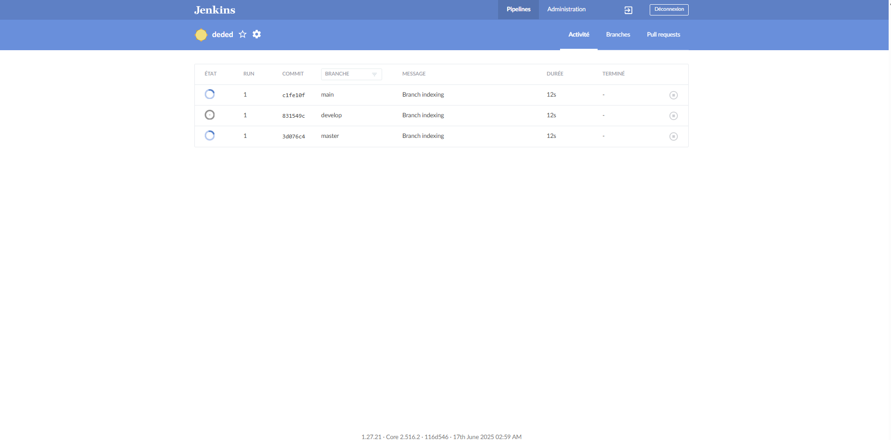
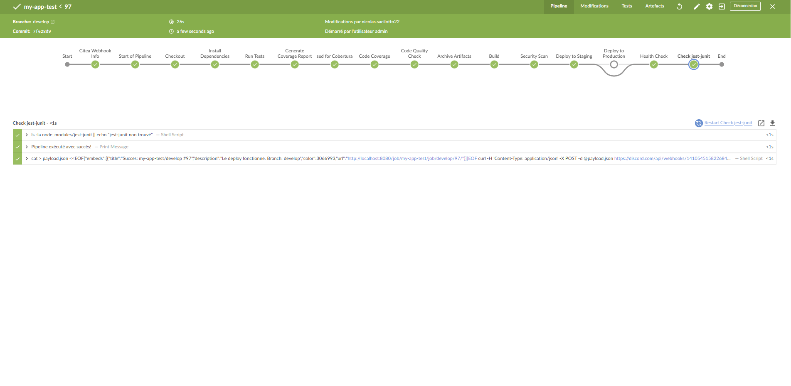
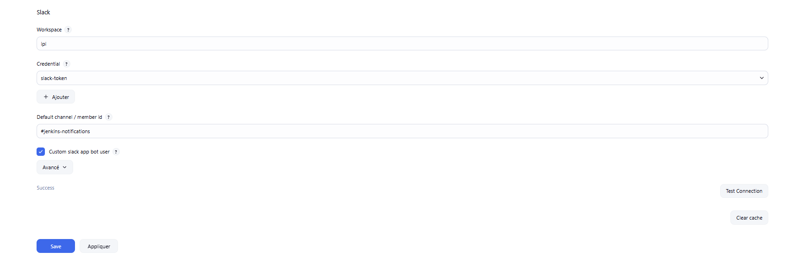
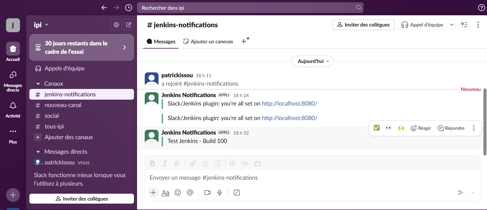
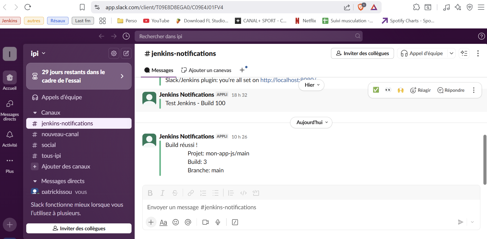
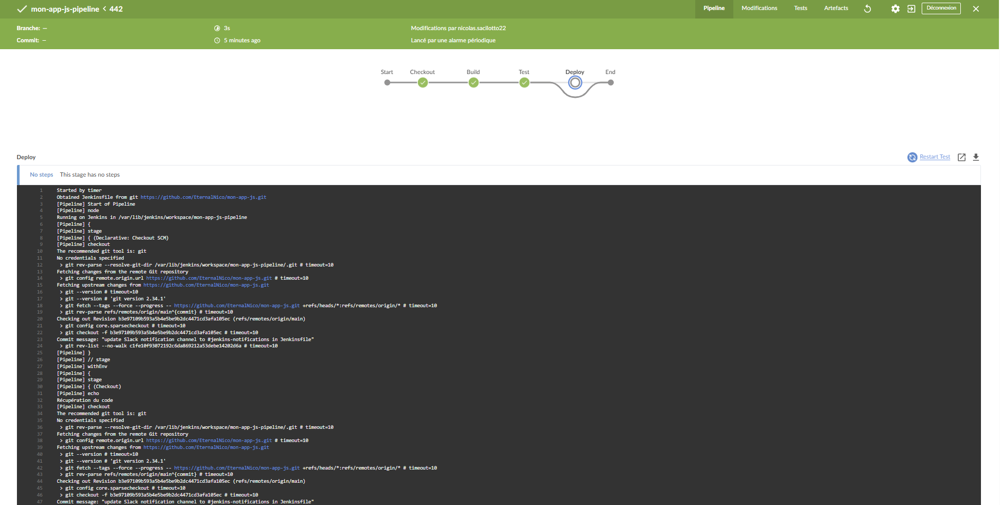
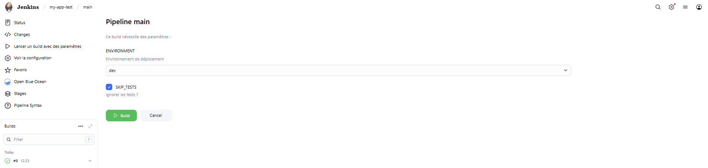
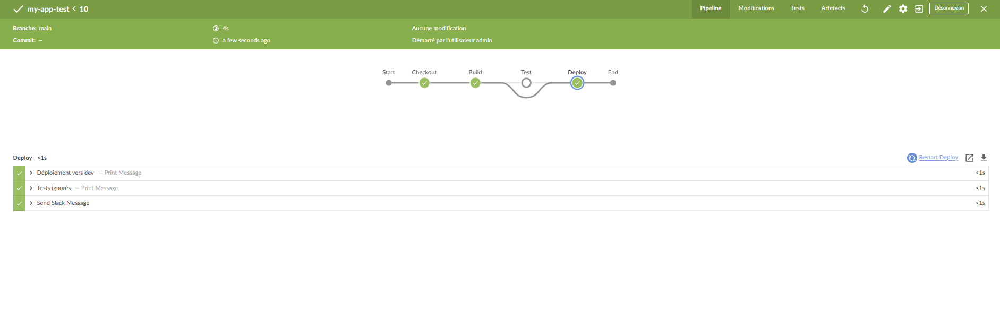
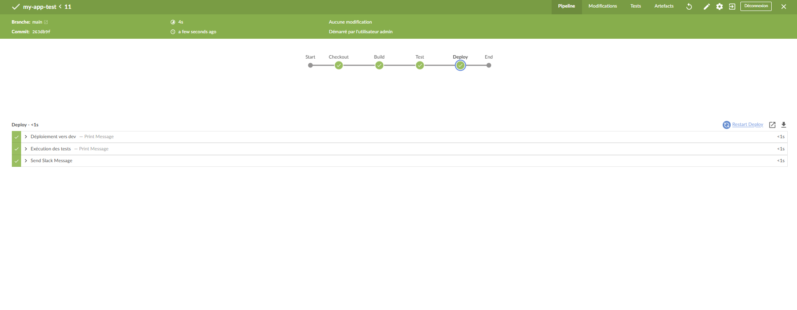

# TP Node.js/Jenkins : Intégration Continue et Déploiement

## Contexte
J’ai configuré un environnement sur **VS Code** pointant vers le répertoire de mon conteneur Docker, dans lequel j’ai installé et configuré **Jenkins**. J’ai également installé le plugin **NodeJS** pour Jenkins afin de gérer une pipeline de déploiement pour un projet Node.js.

---

## Exercice 1 : Premier déploiement
### Étapes réalisées :
1. **Installation de Node.js 18 et npm** dans le conteneur Ubuntu.
2. **Installation des dépendances** du projet avec `npm install`.
3. **Ajout du reporter JUnit pour Jest** dans le `package.json` :
   ```json
   "jest": {
     "reporters": [
       "default",
       ["jest-junit", { "outputDirectory": "tests", "outputName": "junit.xml" }]
     ]
   }
   ```
4. **Modification du `Jenkinsfile`** pour que Jenkins récupère le rapport de test généré par Jest (`test-results.xml`).
5. **Vérification** que le fichier `test-results.xml` est bien créé après l’exécution des tests.

---

## Exercice 2 : Gestion des branches
1. **Création d’une branche `develop`** dans le dépôt Git.
2. **Configuration d’un projet multi-branch** dans Jenkins pour :
   - Récupérer toutes les branches du dépôt.
   - Déclencher la pipeline sur les branches `main` ou `develop`.

---

## Exercice 3 : Tests et qualité
### Ajout d’un test volontairement échoué
J’ai ajouté un test incorrect pour simuler une erreur :
```javascript
test('Tests échoué', () => {
    expect(isValidNumber(Infinity)).toBe(true); // Ce test échoue car `isValidNumber(Infinity)` retourne `false`
});
```
- **Résultat initial** :
  ```
  expect(received).toBe(expected) // Object.is equality
  Expected: true
  Received: false
  ```
  Le job de test affichait une erreur dans la **Pipeline Overview**.

- **Après correction** :
  ```
  Test Suites: 1 passed, 1 total
  Tests:       6 passed, 6 total
  Snapshots:   0 total
  ```
  Le job de test est passé en **success**.

---

## Exercice 4 : Configuration avancée
### Notifications Discord
J’ai créé un **serveur Discord** et configuré un **webhook** pour recevoir des notifications automatiques depuis Jenkins.
Dans le `Jenkinsfile`, j’ai ajouté une section `post` pour gérer trois cas :
- **🟢 Success** : Notification Discord confirmant le succès du déploiement.
- **🔴 Failure** : Notification avec l’erreur en cas d’échec.
- **⚠️ Unstable** : Notification en cas de warnings ou de build instable.

**Processus** :
1. Génération d’un fichier `payload.json` au format attendu par l’API Discord.
2. Envoi du message via `curl` avec le webhook.
3. Suppression du fichier temporaire.

**Résultat** :


---

### Couverture de code
1. **Installation du plugin Code Coverage API** dans Jenkins.
2. **Modification du `package.json`** pour générer un rapport Cobertura :
   ```json
   "jest": {
     "collectCoverage": true,
     "coverageDirectory": "coverage",
     "coverageReporters": ["text", "cobertura"],
     "rootDir": ".",
     "reporters": [
       "default",
       ["jest-junit", { "outputDirectory": "/tmp/tests", "outputName": "junit.xml" }]
     ]
   }
   ```
3. **Configuration initiale de `publishCoverage`** avec des seuils :
   ```groovy
   publishCoverage adapters: [
       coberturaAdapter('coverage/cobertura-coverage.xml')
   ],
   failNoReports: true,
   globalThresholds: [
       [thresholdTarget: 'LINE', unhealthyThreshold: 70.0, unstableThreshold: 80.0],
       [thresholdTarget: 'BRANCH', unhealthyThreshold: 60.0, unstableThreshold: 70.0]
   ]
   ```

#### Problème rencontré
Le plugin **Code Coverage API** a généré une **`NullPointerException`** car certaines métriques (comme `CLASS` ou `METHOD`) étaient manquantes dans le rapport Cobertura. Le plugin tentait d’appliquer des seuils sur des valeurs inexistantes.

#### Solution appliquée
J’ai **supprimé la section `globalThresholds`** pour éviter les erreurs :
```groovy
publishCoverage adapters: [
    coberturaAdapter('coverage/cobertura-coverage.xml')
],
failNoReports: true
```
Désormais, Jenkins :
- Analyse le rapport de couverture.
- L’affiche dans l’interface **sans validation bloquante**.

**Vue du rapport dans Jenkins** :


---

### Archivage des artefacts
J’ai ajouté une étape pour archiver les artefacts :
```groovy
stage('Archive Artifacts') {
    steps {
        echo 'Archivage des artefacts...'
        archiveArtifacts artifacts: 'coverage/**/*, tests/**/*, dist/**/*', allowEmptyArchive: true
    }
}
```
**Résultat** :


---

## Questions de compréhension

### 1. Différence entre `npm install` et `npm ci`
- **`npm install`** :
  Installe les dépendances en mettant à jour le `package-lock.json` si nécessaire. Utile en développement, mais moins adapté à la CI/CD car il peut introduire des variations entre les builds.
- **`npm ci`** :
  Installe **exactement** les versions spécifiées dans le `package-lock.json`. Plus rapide et plus fiable pour des **builds reproductibles** en CI/CD.

### 2. Utilisation de `when` dans les étapes
J’utilise `when` pour exécuter des étapes **conditionnellement** :
- Exemple : Déployer uniquement sur les branches `main` ou `develop`.
- Avantages : Évite des actions inutiles ou dangereuses sur d’autres branches.

### 3. Gestion des erreurs avec les blocs `post`
Les blocs `post` me permettent de :
- **Envoyer des notifications** (Discord, email, etc.) selon le résultat du pipeline (`success`, `failure`, `unstable`).
- **Exécuter des actions correctives** (ex : nettoyage, rollback).

### 4. Intérêt du backup avant déploiement
Avant de déployer une nouvelle version, je sauvegarde l’ancienne. En cas d’échec ou de bug, je peux **restaurer rapidement** l’application à son état précédent.

---

## Améliorations possibles

### Sécurité
- Intégrer **`npm audit`** ou des outils comme **Snyk** pour scanner automatiquement les vulnérabilités des dépendances.

### Performance
- **Mettre en cache** `node_modules` ou les artefacts intermédiaires pour réduire les temps de build.

### Monitoring
- Ajouter un **health check automatisé** après le déploiement.
- Utiliser **Prometheus/Grafana** pour surveiller l’état de l’application en temps réel.

### Rollback
- Mettre en place un **mécanisme de rollback automatique** si le déploiement échoue ou si le health check détecte un problème.

---

## Bilan
Ce TP m’a permis de :
✅ Configurer une pipeline CI/CD complète avec Jenkins et Node.js.
✅ Gérer les tests, la couverture de code, et les notifications.
✅ Automatiser des actions post-build (archivage, notifications, backup).
✅ Identifier des axes d’amélioration pour la sécurité, la performance et la fiabilité.

---
**Prochaines étapes** :
- Automatiser davantage les tests de sécurité.
- Optimiser les temps de build avec du caching.
- Implémenter un système de rollback intelligent.


---

## Annexes : Configuration des plugins Jenkins (Blue Ocean, Slack, Gitea)

### Partie 1 : Installation des plugins
**Étape 1 : Installation via l'interface Jenkins**
J'ai ouvert Jenkins (http://localhost:8080), puis je suis allé dans "Manage Jenkins" → "Manage Plugins". Dans l'onglet "Available", j'ai recherché et installé :
  - Blue Ocean
  - Slack Notification Plugin
  - Gitea Plugin (ou Git Plugin)
J'ai cliqué sur "Install without restart" et attendu la fin de l'installation.

**Étape 2 : Vérification de l'installation**
Je suis retourné au tableau de bord Jenkins, j'ai vérifié la présence du bouton "Open Blue Ocean" et la présence des sections Slack et Gitea dans "Manage Jenkins" → "Configure System".

### Partie 2 : Configuration du plugin Blue Ocean
**Qu'est-ce que Blue Ocean ?**
Blue Ocean est une interface moderne pour Jenkins qui améliore la visualisation des pipelines.


**Résultat** :



**Configuration**
J'ai cliqué sur "Open Blue Ocean" dans le menu Jenkins, puis j'ai exploré l'interface : vue des pipelines, éditeur visuel, historique des builds. Blue Ocean n'a pas nécessité de configuration supplémentaire.


**Exercice 2.1** : J'ai créé un pipeline simple via Blue Ocean et j'ai observé la différence avec l'interface classique.


**Résultat** :


### Partie 3 : Configuration du plugin Slack
**Étape 1 : Préparation de Slack**
- Je suis allé sur https://api.slack.com/apps
- J'ai créé une nouvelle app : "Create New App" → "From scratch"
- J'ai nommé mon app : "Jenkins Notifications"
- Dans "OAuth & Permissions", j'ai ajouté les permissions :
  - chat:write
  - chat:write.public

**Étape 2 : Configuration dans Jenkins**
- Je suis allé dans "Manage Jenkins" → "Configure System"
- J'ai trouvé la section "Slack"
- J'ai configuré :
  - Workspace : nom de mon workspace Slack
  - Credential : J'ai créé une nouvelle credential
  - Kind : "Secret text"
  - Secret : mon Bot User OAuth Token
  - ID : "slack-token"
  - Default channel : #general (ou j'ai créé un canal dédié)
- J'ai testé la connexion


**Étape 3 : Test des notifications**
J'ai créé un job simple pour tester :

```groovy
pipeline {
  agent any
  stages {
    stage('Test') {
      steps {
        echo 'Test du pipeline'
      }
    }
  }
  post {
    always {
      slackSend(
  channel: '#jenkins-notifications',
        color: 'good',
        message: "Test Jenkins - Build ${env.BUILD_NUMBER}"
      )
    }
  }
}
```


**Exercice 3.1** : J'ai configuré les notifications Slack et j'ai testé avec un pipeline simple.


**Connexion** :


**Résultat** :



### Partie 4 : Configuration du plugin Gitea
**Étape 1 : Configuration des credentials Git**
- Je suis allé dans "Manage Jenkins" → "Manage Credentials"
- J'ai ajouté une nouvelle credential :
  - Kind : Username with password
  - Username : mon nom d'utilisateur Git
  - Password : mon mot de passe ou token
  - ID : git-credentials

**Étape 2 : Configuration des webhooks (optionnel)**
Si j'ai utilisé Gitea :
- Dans mon repository Gitea, je suis allé dans "Settings" → "Webhooks"
- J'ai ajouté un webhook :
  - URL : http://jenkins-url:8080/gitea-webhook/post
  - Content Type : application/json
  - Events : Push events

**Étape 3 : Test avec un repository**
- J'ai créé un job multibranch pipeline :
  - "New Item" → "Multibranch Pipeline"
  - J'ai configuré la source Git :
    - Repository URL : URL de mon repository
    - Credentials : j'ai sélectionné git-credentials
  - J'ai sauvegardé

**Exercice 4.1** : J'ai connecté un repository Git et j'ai configuré un pipeline automatique.


**Résultat** :


### Partie 5 : Pipeline intégré avec les trois plugins
**Exemple de Jenkinsfile complet**

```groovy
pipeline {
  agent any
  stages {
    stage('Checkout') {
      steps {
        echo 'Récupération du code'
        checkout scm
      }
    }
    stage('Build') {
      steps {
        echo 'Construction de l\'application'
        // Ajoutez vos commandes de build ici
      }
    }
    stage('Test') {
      steps {
        echo 'Exécution des tests'
        // Ajoutez vos commandes de test ici
      }
    }
    stage('Deploy') {
      when {
        branch 'main'
      }
      steps {
        echo 'Déploiement en production'
        // Ajoutez vos commandes de déploiement ici
      }
    }
  }
  post {
    success {
      slackSend(
        channel: '#general',
        color: 'good',
        message: """
        Build réussi !\nProjet: ${env.JOB_NAME}\nBuild: ${env.BUILD_NUMBER}\nBranche: ${env.BRANCH_NAME}"
      )
    }
    failure {
      slackSend(
        channel: '#general',
        color: 'danger',
        message: """
        Build échoué !\nProjet: ${env.JOB_NAME}\nBuild: ${env.BUILD_NUMBER}\nVoir: ${env.BUILD_URL}"
      )
    }
  }
}

```
**Test du pipeline intégré**
J'ai créé un repository avec ce Jenkinsfile, configuré le job multibranch pipeline, puis fait un push pour déclencher le build. J'ai vérifié la visualisation dans Blue Ocean, les notifications Slack et l'intégration Git.

**Exercice 5.1** : J'ai créé un pipeline complet utilisant les trois plugins et j'ai testé toutes les fonctionnalités.

**Résultat** :



### Partie 5 : Pipeline intégré avec les trois plugins

Grâce à l’ajout du code fourni dans le TP, j’ai pu lancer des pipelines paramétrés : je peux choisir l’environnement de déploiement (dev, staging ou prod) et activer ou non l’option pour ignorer les tests avant le déploiement.

Voici un test de lancement de pipeline avec paramètre comme le montre l'image ci-dessous : 

**IHM Jenkins pipeline avec paramètres** :


**Résultat de la pipeline (avec "skip tests")** :



Voici le résultat sans la case cocher "skip test"

**Résultat de la pipeline (sans "skip tests")** :



