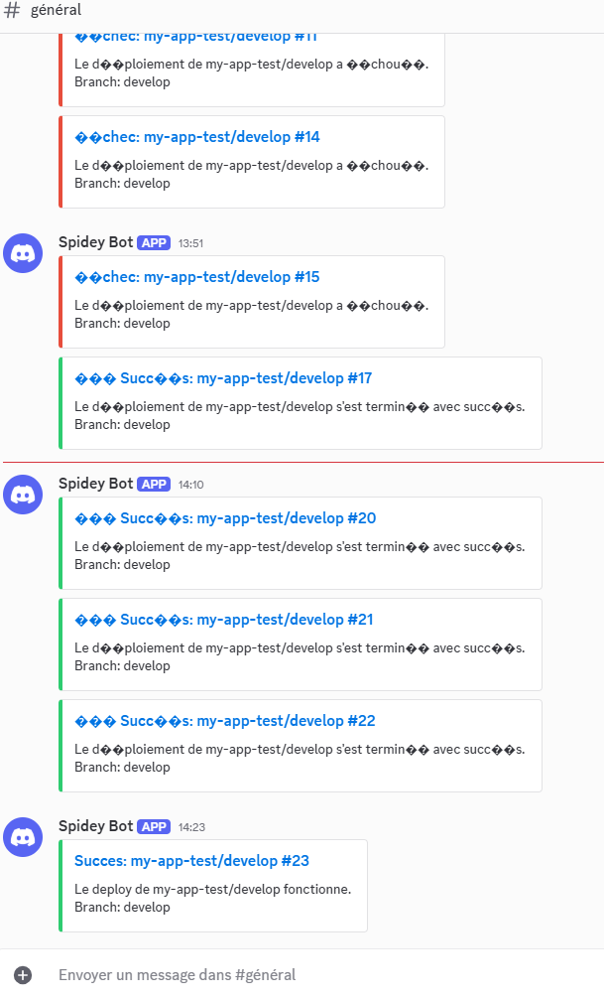

Pour ce tp : 

j'ai setup un environnement sur l'IDE Vscode qui contient le répertoire de mon conteneur docker dans lequel j'ai installé et configuré jenkins

tp node/jenkins, j'ai installé le plugin nodeJS

pour faire fonctionner la pipeline : 

Exercice 1 : Premier déploiement
Pour ce TP, j’ai configuré un environnement sur l’IDE VS Code, qui pointe vers le répertoire de mon conteneur Docker où Jenkins est installé et configuré. J’ai également installé le plugin NodeJS pour Jenkins.

Pour faire fonctionner la pipeline Node.js avec Jenkins, j’ai procédé ainsi :
J’ai installé Node.js 18 et npm dans le conteneur Ubuntu. Ensuite, j’ai installé les dépendances du projet avec la commande appropriée. J’ai ajouté le reporter JUnit pour Jest dans le fichier package.json, puis j’ai installé ce reporter. J’ai modifié le Jenkinsfile afin que Jenkins puisse récupérer le rapport de test généré par Jest. Enfin, j’ai vérifié que le fichier test-results.xml est bien créé après l’exécution des tests.

2. Exercice 2 : Gestion des branches
Création d'une branche develop, création d'un projet multi branch qui permet de récupérer toutes les branches du repo git et de pouvoir de déclencher la pipeline de la branche main ou la branche develop 

3. Exercice 3 : Tests et qualité
test rajouté : 
test('Tests échoué', () => {
        expect(isValidNumber(Infinity)).toBe(true);
});

la stacktrace d'erreur : 
expect(received).toBe(expected) // Object.is equality
    Expected: true
    Received: false
      35 |
      36 |     test('Tests échoué', () =&gt; {
    &gt; 37 |         expect(isValidNumber(Infinity)).toBe(true);
         |                                         ^
      38 |     });
      39 | });
      at Object.toBe (tests/app.test.js:37:41)

dans la pipeline overview j'ai une erreur sur le job de test.
Après la correction : 
Test Suites: 1 passed, 1 total
Tests:       6 passed, 6 total
Snapshots:   0 total
Time:        0.24 s, estimated 1 s
Ran all test suites.

et dans la pipeline overview le job de test est en success

4. Exercice 4 : Configuration avancée

j'ai créé un serveur discord dans lequel j'ai créé un webhook pour recevoir les notifs dans mon serveur

Dans mon Jenkinsfile, j’ai ajouté une section post pour gérer ce qui se passe une fois que le pipeline est terminé.

J’ai défini trois cas :

success 🟢 : quand le pipeline s’exécute correctement, j’envoie une notification sur Discord pour confirmer que le déploiement s’est bien passé.

failure 🔴 : si le pipeline échoue, j’envoie un message Discord avec l’erreur, pour prévenir rapidement.

unstable ⚠️ : si le build est instable (par exemple des warnings), j’envoie aussi une notification Discord pour signaler le problème.

Pour chaque cas, je génère un fichier payload.json avec le contenu au format attendu par l’API Discord, je l’envoie via curl avec mon webhook, puis je supprime le fichier.

Ça me permet d’avoir un suivi automatique de mes pipelines directement dans Discord, sans devoir aller consulter Jenkins à chaque fois.

l'image des pipelines depuis discord : 

pour le coverage : 

j'ai installé le plugin COVERAGE API

🎯 Problème rencontré

Dans ma pipeline Jenkins, j’avais configuré publishCoverage avec des seuils comme ceci :

publishCoverage adapters: [
    coberturaAdapter('coverage/cobertura-coverage.xml')
],
failNoReports: true,
globalThresholds: [
    [thresholdTarget: 'LINE', unhealthyThreshold: 70.0, unstableThreshold: 80.0],
    [thresholdTarget: 'BRANCH', unhealthyThreshold: 60.0, unstableThreshold: 70.0]
]

Le plugin code-coverage-api a essayé de comparer mon rapport de couverture avec ces seuils (par exemple, “au moins 80% des lignes doivent être couvertes”).
Mais dans mon fichier Cobertura (cobertura-coverage.xml), certaines métriques n’étaient pas présentes (par ex. CLASS ou METHOD). Résultat : le plugin a tenté d’appliquer un seuil sur une valeur inexistante → j’ai eu une NullPointerException.

✅ Solution que j’ai appliquée

J’ai supprimé la section globalThresholds :

publishCoverage adapters: [
    coberturaAdapter('coverage/cobertura-coverage.xml')
],
failNoReports: true

Désormais, Jenkins se contente de :

analyser mon fichier de couverture,

l’afficher dans l’interface,

sans validation bloquante sur des seuils inexistants.

📌 Ce que je note pour mon README

Lors de la configuration de la couverture de code dans Jenkins :

J’utilise le plugin publishCoverage pour publier les rapports générés par Jest au format Cobertura.

Initialement, j’avais défini des seuils (globalThresholds) pour valider un certain niveau de couverture.

Ces seuils ont provoqué une erreur (NullPointerException) car Jest ne génère pas toutes les métriques attendues.
